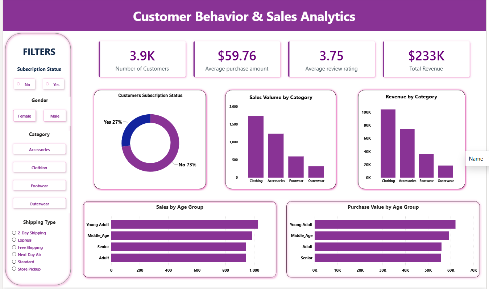

# 📊 Customer Behavior & Sales Analytics

> **An end-to-end data analytics project using SQL and Power BI to analyze customer purchasing behavior, sales performance, revenue, and customer segments.**


\

---

## 📌 Project Overview

**Customer Behavior & Sales Analytics** is a data analytics project created to gain hands-on experience with **SQL and Power BI** while understanding how data can be transformed into meaningful business insights.

The project analyzes customer shopping data to identify patterns in:

* Customer purchasing behavior
* Sales performance
* Revenue contribution
* Product categories
* Subscription behavior
* Customer age groups
* Discount usage
* Shipping preferences

The final output is an **interactive Power BI dashboard** supported by SQL-based business analysis.

---

## 🎯 Project Objectives

The main objectives of this project were to:

* Analyze customer shopping behavior using SQL.
* Identify the categories contributing most to sales and revenue.
* Compare purchasing behavior across customer segments.
* Understand subscription and repeat-purchase behavior.
* Analyze revenue contribution across age groups.
* Build an interactive Power BI dashboard for business reporting.
* Gain practical experience with a real-world-style analytics workflow.

---

## 🛠️ Tools & Technologies

| Tool            | Purpose                                 |
| --------------- | --------------------------------------- |
| **SQL**         | Data analysis and business questions    |
| **Power BI**    | Interactive dashboard and visualization |
| **CSV Dataset** | Source data                             |

---

## 📂 Project Structure

```text
customer-behavior-sales-analytics/
│
├── SQL/
│   └── customer_behavior_analytics.sql
│
├── PowerBI/
│   ├── customer_behavior_dashboard.pbix
│   └── dashboard.png
│
├── Data/
│   └── customer_shopping_behavior.csv
│
├── README.md
├── LICENSE
└── .gitignore
```

---

## 📊 Dataset

The dataset contains **3,900 customer shopping records** across **18 attributes**.

Some of the key fields include:

* Customer ID
* Age
* Gender
* Item Purchased
* Category
* Purchase Amount
* Discount Applied
* Review Rating
* Subscription Status
* Shipping Type
* Previous Purchases
* Payment Method
* Frequency of Purchases

---

# 🔎 SQL Analysis

SQL was used to answer practical business questions from the dataset.

### Key questions analyzed

**01 — Revenue by Gender**

> What is the total revenue generated by male vs. female customers?

**02 — Discount & Purchase Behavior**

> Which customers used a discount but still spent more than the average purchase amount?

**03 — Product Ratings**

> Which are the top 5 products with the highest average review rating?

**04 — Shipping Analysis**

> How do average purchase amounts compare between Standard and Express shipping?

**05 — Subscription Behavior**

> Do subscribed customers spend more than non-subscribed customers?

**06 — Discount Analysis**

> Which 5 products have the highest percentage of purchases with a discount applied?

**07 — Customer Segmentation**

> How can customers be segmented into New, Returning, and Loyal customers based on previous purchases?

**08 — Category-Level Product Ranking**

> What are the top 3 most purchased products within each category?

**09 — Repeat Buyers & Subscription**

> Are customers with more than 5 previous purchases more likely to subscribe?

**10 — Age Group Revenue**

> What is the revenue contribution of each age group?

📁 All queries are available in:

`SQL/customer_behavior_analytics.sql`

---

# 📈 Power BI Dashboard

The SQL analysis was complemented by an interactive Power BI dashboard designed to provide a high-level view of customer behavior and sales performance.

### Dashboard KPIs

| KPI                        |      Value |
| -------------------------- | ---------: |
| 👥 Customer Count          |   **3.9K** |
| 💰 Average Purchase Amount | **$59.76** |
| ⭐ Average Review Rating    |   **3.75** |
| 💵 Total Revenue           |  **$233K** |

### Dashboard Analysis Includes

* Customer Subscription Status
* Sales Volume by Category
* Revenue by Category
* Customer Distribution by Age Group
* Purchase Value by Age Group
* Interactive customer filters
* Gender analysis
* Category analysis
* Shipping type analysis

---

## 🖼️ Dashboard Preview


---

# 💡 Key Insights

### 🛍️ Category Performance

**Clothing** is the strongest-performing category in the dashboard's sales and revenue comparisons, making it an important category for business attention.

### 👥 Subscription Behavior

The dashboard shows a considerably larger **non-subscribed customer segment** compared with subscribed customers, highlighting an opportunity to investigate subscription conversion strategies.

### 🎯 Age Group Analysis

The **Young Adult** segment shows strong purchasing activity in the dashboard's age-group analysis.

### 💰 Revenue Analysis

Comparing revenue across categories and customer segments helps identify where the business is generating the greatest monetary contribution.

### 🚚 Shipping Behavior

The dashboard allows users to compare customer purchasing behavior across different shipping options, helping identify potential relationships between shipping preferences and purchase activity.

---

# 📌 Business Recommendations

Based on the analysis, potential business actions include:

* Develop targeted strategies to convert non-subscribed customers into subscribers.
* Maintain strong inventory and promotional focus on high-performing categories.
* Create targeted marketing campaigns for high-value customer segments.
* Investigate lower-performing categories to understand demand and pricing factors.
* Analyze repeat customers separately to identify opportunities for customer retention.
* Use interactive segmentation to support more targeted marketing and sales decisions.

---

# 📊 Dashboard Features

The Power BI dashboard includes interactive slicers for:

* **Subscription Status**
* **Gender**
* **Category**
* **Shipping Type**

Users can combine these filters to explore specific customer segments and understand how different attributes affect sales and purchasing behavior.

---

# 🚀 What I Learned

This project helped me develop practical experience in:

* Writing analytical SQL queries
* Using aggregations and `GROUP BY`
* Working with subqueries
* Using CTEs
* Applying `CASE` statements
* Using window functions such as `ROW_NUMBER()`
* Performing customer segmentation
* Building interactive Power BI dashboards
* Designing KPI-driven reports
* Translating data into business insights

---

# 🎓 Project Purpose

This project was created primarily as a **hands-on learning and portfolio project**.

The goal was to move beyond learning individual SQL queries or Power BI features and understand how these skills can be combined to approach a real-world-style business analytics problem.

---

## 👨‍💻 Author

**Shaik  Jamaal**

Data Analytics Enthusiast | SQL | Power BI

---

⭐ If you found this project useful, feel free to explore the SQL analysis and Power BI dashboard.
